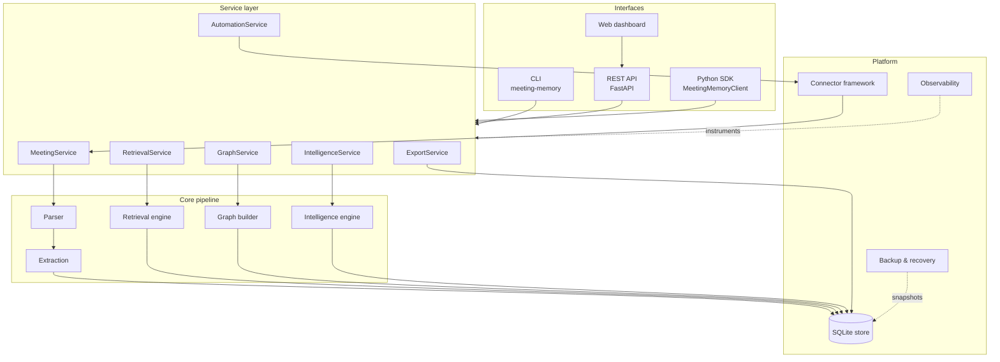
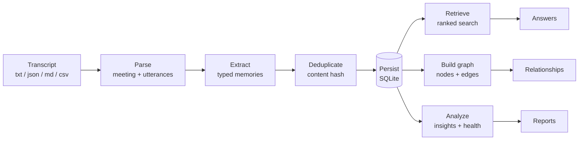
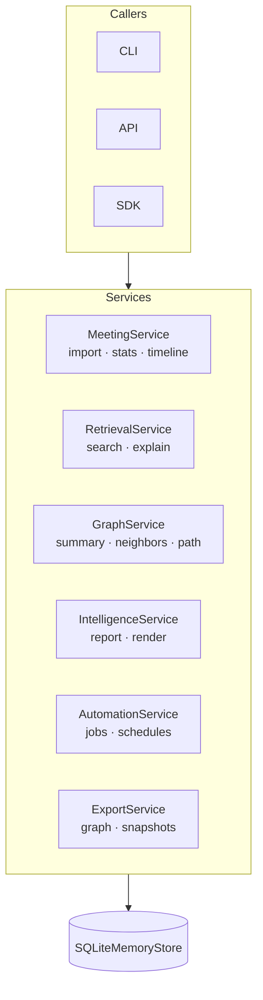
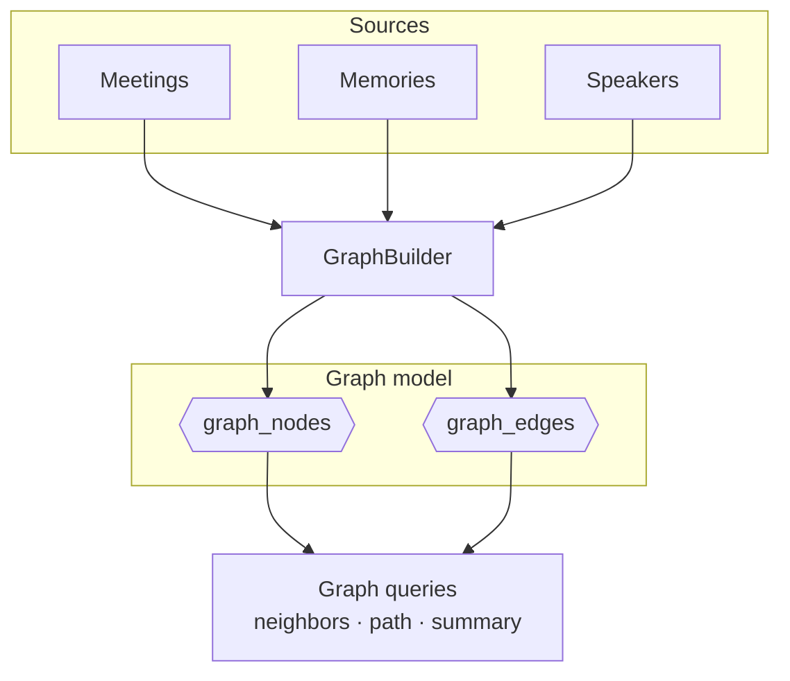
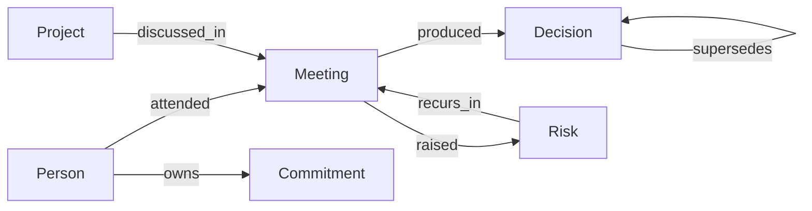
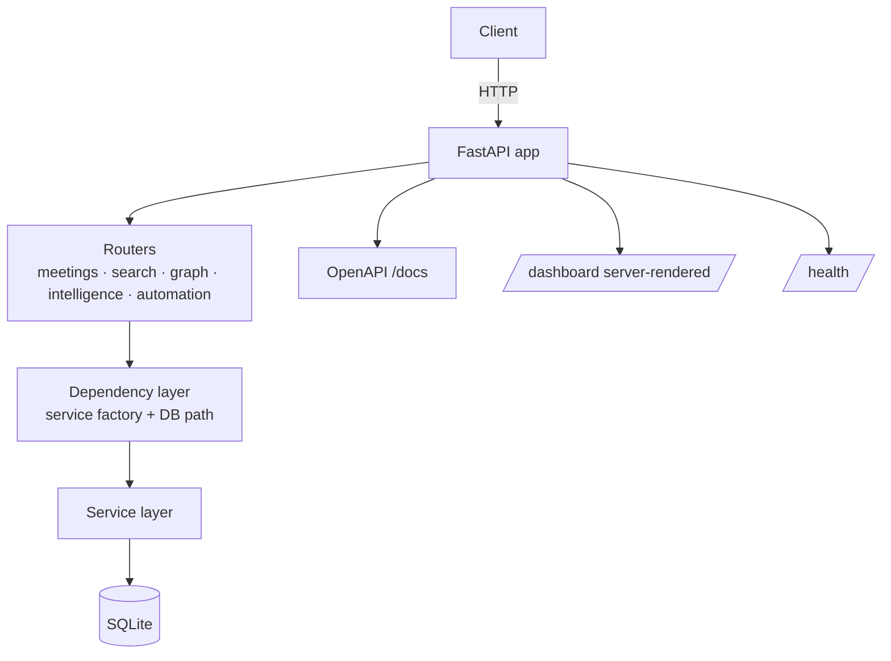
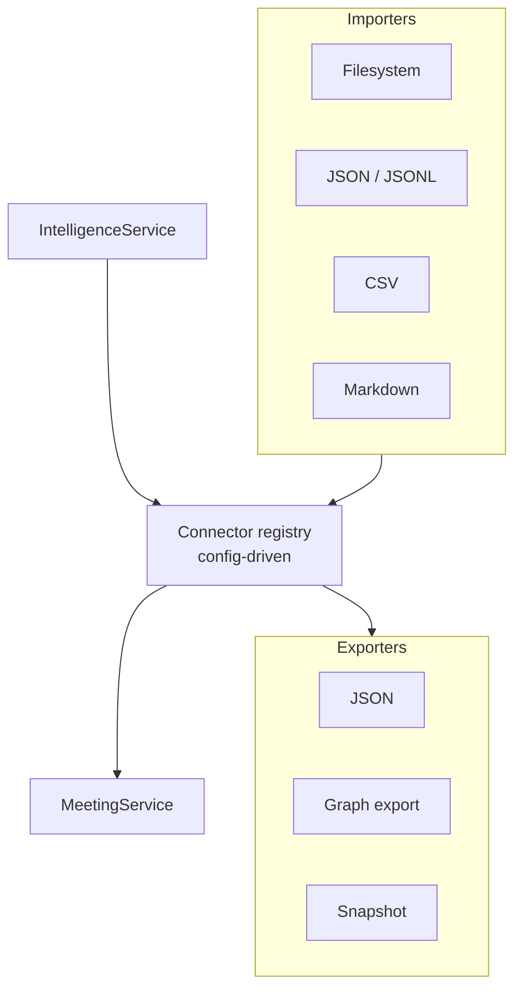
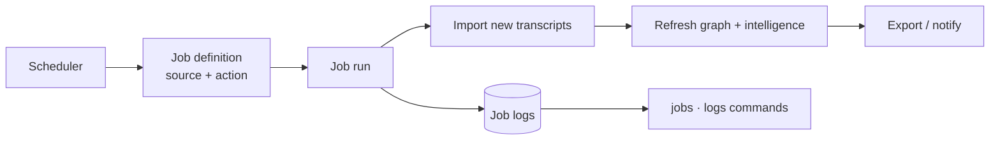
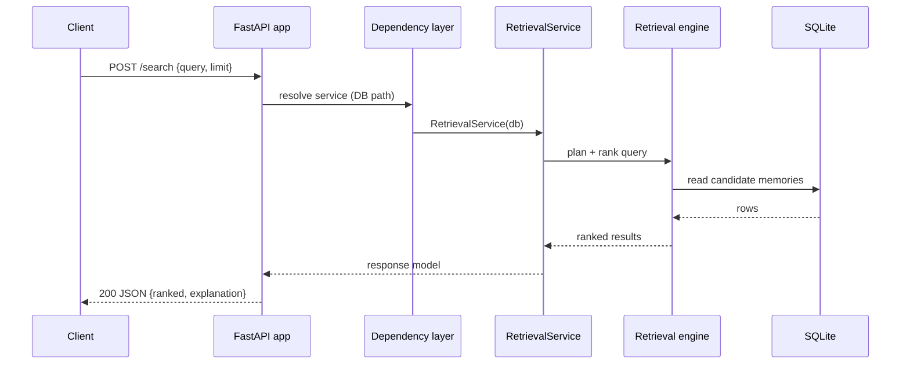

# Architecture

This page collects the system's architecture as a set of diagrams. Every diagram is
authored in [Mermaid](https://mermaid.js.org/) so it renders directly on GitHub and in
the MkDocs documentation site. See [Exporting diagrams](#exporting-diagrams) to produce
PNG/SVG assets from these sources.

The Meeting Memory System is a deterministic, local-first pipeline. There are no
external services and no LLM calls: every transcript is turned into structured,
queryable institutional memory by rule-based extraction and analysis.

## Overall architecture



## Data flow

How a raw transcript becomes queryable memory and intelligence.



## Service layer

The service layer is the single reusable surface shared by the CLI, REST API, and SDK.
Each service wraps the core pipeline and the store with a stable, typed contract.



## Graph architecture

The organizational graph projects stored memories into nodes (people, projects,
meetings, decisions, risks, …) connected by typed relationships.





## API architecture



## Connector framework

Connectors are the pluggable boundary for importing transcripts from, and exporting
results to, external systems — all behind deterministic, offline interfaces.



## Automation pipeline



## Request lifecycle

End-to-end path of a single `POST /search` request.



## Exporting diagrams

The Mermaid sources above are the source of truth. To render standalone SVG/PNG assets
(for slides or printed docs), use the Mermaid CLI:

```bash
npm install -g @mermaid-js/mermaid-cli
# Extract a diagram into diagram.mmd, then:
mmdc -i diagram.mmd -o diagram.svg
mmdc -i diagram.mmd -o diagram.png -b transparent
```

GitHub and the MkDocs site render these diagrams natively, so exported assets are only
needed for environments without Mermaid support.
