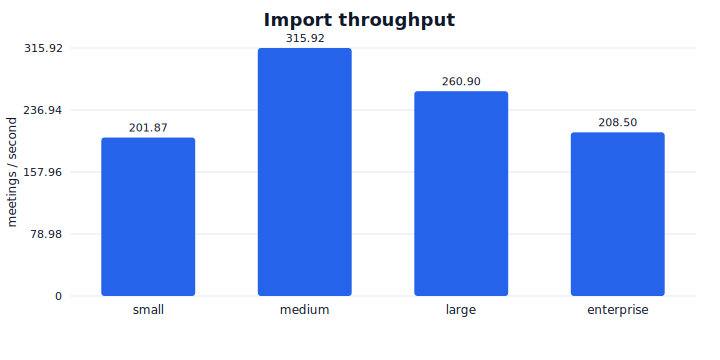
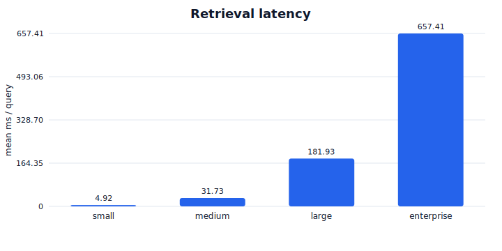
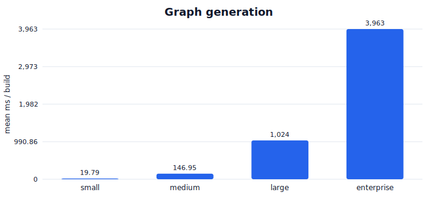
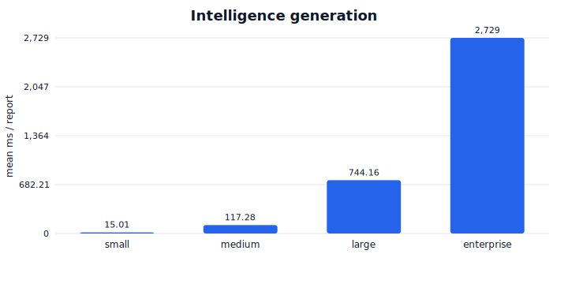
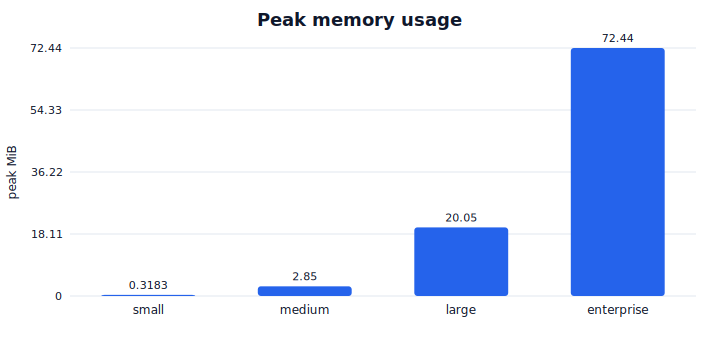
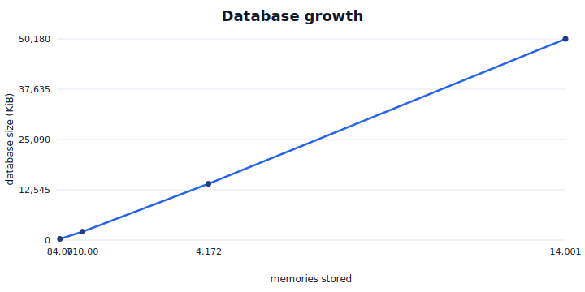

# Benchmark visualizations

These charts are rendered from the deterministic benchmark suite
(`meeting-memory benchmark`) across the bundled dataset presets — *small*, *medium*,
*large*, and *enterprise*. The datasets are reproducible; absolute timings depend on the
machine, so treat the numbers as relative trends rather than guarantees. See
[performance.md](performance.md) for how the benchmarks work.

## Regenerating the charts

```bash
python examples/ops/benchmark_charts.py --out docs/assets/benchmarks
```

Or render per-operation charts for a single run straight from the CLI:

```bash
meeting-memory benchmark --dataset medium --charts ./charts
```

The charts are dependency-free SVG (no plotting library), produced by
`meeting_memory.benchmarks.visualize`.

## Import throughput

Meetings imported per second as the dataset grows.



## Retrieval latency

Mean ranked-search latency per query.



## Graph generation

Mean time to build the organizational graph summary.



## Intelligence generation

Mean time to assemble a full intelligence report.



## Memory usage

Peak traced memory while generating intelligence.



## Database growth

On-disk database size as the number of stored memories increases.


