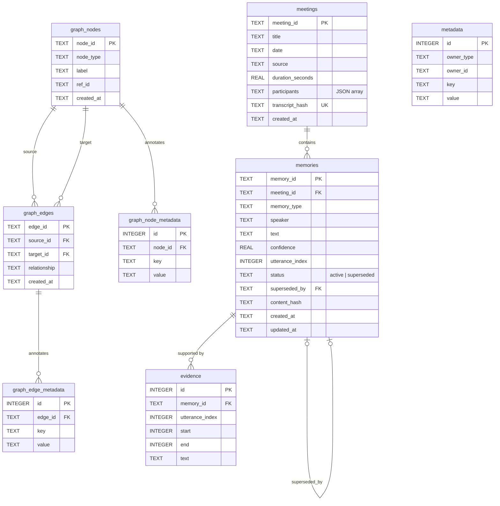

# Database schema

The system stores everything in a single SQLite database. The schema is created and
upgraded by ordered, append-only migrations (`src/meeting_memory/storage/migrations.py`);
`PRAGMA user_version` records how many have been applied, so opening an older database
upgrades it in place.

- **Version 1** — core memory store: `meetings`, `memories`, `evidence`, `metadata`.
- **Version 2** — organizational graph: `graph_nodes`, `graph_edges`, and their metadata.

## Entity relationship diagram

## Table reference

### `meetings`
One row per imported transcript. `transcript_hash` is unique, which makes re-importing
the same transcript idempotent. `participants` is a JSON-encoded array of speaker names.

### `memories`
The typed knowledge extracted from a meeting (decisions, risks, commitments, questions,
facts, assumptions, open loops). `status` plus `superseded_by` model decision lifecycle:
a memory can be marked `superseded` and point at the memory that replaced it.
`content_hash` powers deduplication and recurrence detection.

### `evidence`
The verbatim utterance spans that justify each memory, so every extracted item is
traceable back to the transcript text.

### `metadata`
Generic key/value annotations attached to any owner (`owner_type` + `owner_id`),
used for extensible attributes without schema changes.

### `graph_nodes` / `graph_edges`
The organizational graph. Nodes carry a `node_type` (person, project, meeting, decision,
risk, …) and a `ref_id` linking back to the source row. Edges carry a typed
`relationship` between two nodes. The `*_metadata` tables store extensible attributes.

## Indexes

Indexes back the common access paths: meetings by date; memories by meeting, type,
status, speaker, and content hash; evidence by memory; metadata by owner; and graph
nodes/edges by type, source, target, and relationship.

## Migration policy

Migrations are append-only. To evolve the schema, add a new script to the `MIGRATIONS`
tuple — never edit an existing one. This keeps upgrades deterministic and lossless: each
script `i` upgrades a database from version `i` to `i + 1`.
